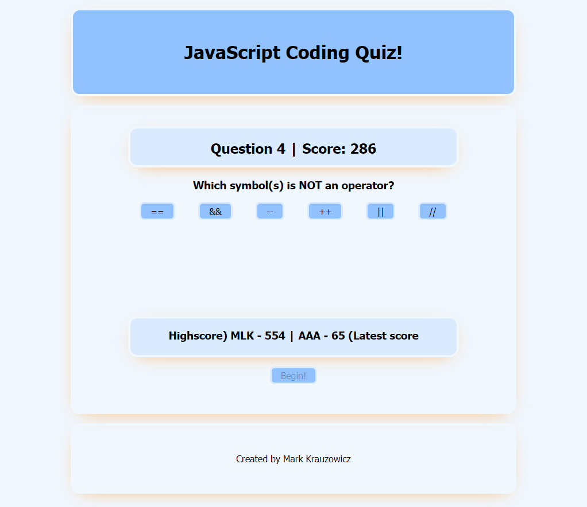

# Javascript-Code-Quiz
A timed code quiz challenge, covering basic javascript. Scores are given and a local leaderboard available.

## Functionality
When deployed and the "Begin!" button clicked by the user, a 60-second timed quiz on general javascript knowledge begins. Wrong answers result in a subtraction in time and score. Once all questions have been answered or the score reaches zero, the user is prompted to record their initials to allow their score to be saved to a local leaderboard.

## Usage
No installation or deploy is required. This project is hosted live on [Github Pages](https://mlkrauz.github.io/Javascript-Code-Quiz/).

## Fun Notes
This project was for a coding bootcamp I'm enrolled in. I try to add features beyond the simple requirements. This time around, I wrapped much of the JS functionality in classes (which have not been covered yet). You may also notice that the ordering of both the questions and answers is shuffled between quiz sessions!
